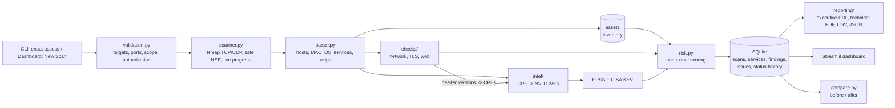

# ENSAT architecture

## Pipeline



| Step | Module | Notes |
|---|---|---|
| 1. Validate | `validation.py` | Rejects option-injection (`-x`), shell metacharacters and malformed IPs/ports. Enforces the host limit and the scope file. Out-of-scope targets need explicit confirmation, which is stored with the scan. |
| 2. Scan | `scanner.py` | Builds argument lists (never a shell string) and streams `-oX -` with `--stats-every` for live progress. Falls back to a connect scan when unprivileged. UDP runs separately and is merged. |
| 3. Parse | `parser.py` | Handles multiple addresses (IP + MAC/vendor), user and PTR hostnames, best OS match, all CPEs, and port- and host-level NSE output. |
| 4. Inventory | `db.upsert_assets` | Persistent assets keyed by address with first/last seen, criticality, business impact, exposure, owner and a "known" flag. |
| 5. Checks | `checks/` | `network.py` rules match the detected service before the port. NSE output becomes concrete findings. TLS and web checks run concurrently (12 workers). |
| 6. Intel | `intel/` | CPE 2.2 to 2.3 conversion with vendor aliases, and NVD `cpeName` with a `virtualMatchString` fallback. Every CVE is checked against NVD's version ranges. EPSS runs in batches and KEV is cached for 24 h. All responses are cached in SQLite, and NVD rate limits are respected. |
| 7. Risk | `risk.py` | Explainable adjustments (see README). `prioritise()` orders findings by severity, risk, KEV and EPSS. |
| 8. Store | `db.complete_scan` | Saves a per-scan snapshot and updates issues by fingerprint. Status transitions: re-detected REMEDIATED/VERIFIED issues are reopened, and REMEDIATED issues that the same scope no longer sees become VERIFIED. |
| 9. Report | `reporting/` | ReportLab with escaped content. A failed report never loses the scan. |

## Data model

```mermaid
erDiagram
    scans ||--o{ scan_hosts : contains
    scans ||--o{ services : contains
    scans ||--o{ findings : produced
    assets ||--o{ scan_hosts : "observed as"
    scan_hosts ||--o{ services : runs
    issues ||--o{ findings : "observed in"
    issues ||--o{ status_history : tracks

    scans { int id; text target; text profile; text scope_key; text status; text authorized_by; int out_of_scope; text nmap_args }
    assets { text address; text mac; text vendor; text os_name; text criticality; text business_impact; text exposure; int known }
    findings { int scan_id; text fingerprint; text check_id; text cve; real base_score; real risk_score; text severity; real epss; int kev }
    issues { text fingerprint; text status; text assignee; text notes; int first_seen_scan; int last_seen_scan }
    status_history { text fingerprint; text old_status; text new_status; text changed_by; text note }
```

A finding's **fingerprint** is `sha1(host | port | protocol | check_id | cve)`. The same problem seen in several scans
therefore stays one issue with one status, while each scan keeps its own snapshot for comparison and reporting.

## Safety design

- Nmap only runs scripts from the `safe` category: banner, http-title, http-server-header, ssl-cert, ftp-anon,
  smb2-security-mode, smb-protocols, dns-recursion and redis-info. The `full` profile adds ssl-enum-ciphers,
  ssh2-enum-algos and mongodb-info.
- Web checks send only GET and OPTIONS requests, to `/` and a fixed list of well-known files. Each response is checked
  by content to avoid soft-404 false positives.
- Requests to targets ignore environment proxies, so assessment traffic goes directly to the target.
- Each scan records the operator, the authorization reference and whether the target was outside the scope file.
